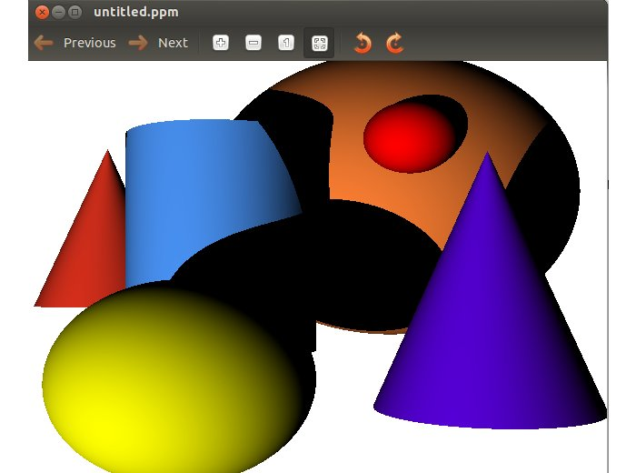
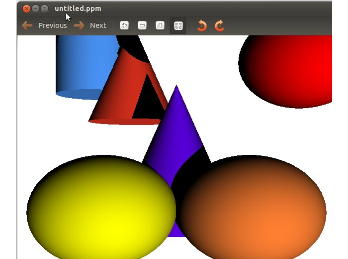
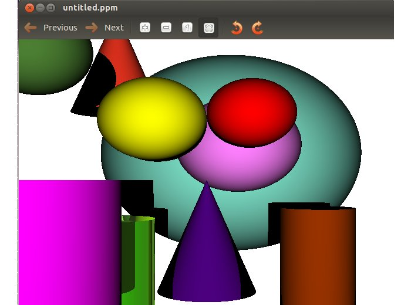
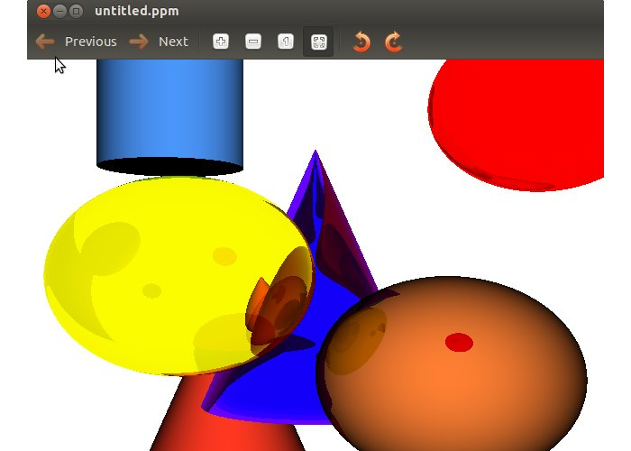
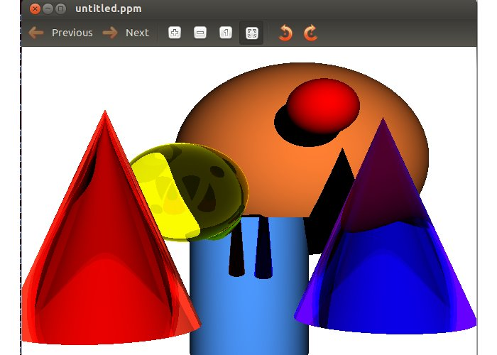
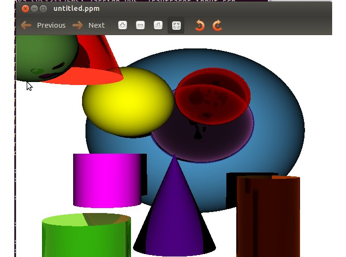

# Ray Tracing

## CS 775 Computer Graphics - Assignment 1 Part 1

* * *

We have implemented RayTracer as part of our assignment. It can create a Scene with sphere, cone and cylinder. It can also enable 3 material properties to them viz. Diffuse, Reflective and Reflective+Transparent. It shows the interaction of Light rays with them. It also allow to Render Scene, with Light Source at different Location.  
[Problem Statment](http://www.cse.iitb.ac.in/~paragc/teaching/2014/cs775/assignments/A2/A2.pdf)

### Code Description

**render.cpp**  

*   Contain Parser to parse the scene file
*   Calculate intersection point and normal with object at minimum distance.
*   If object is diffuse, then find whether ray can reach the light source. If it can, assign color to object else its in shadow.
*   If object is reflective or transparent, simple reflection and refraction are performed, and the aggregated color, weighted by Fresnel Ration is applied to the object.
*   If aliasing is on, then it will perform 4x supersampling.

**object.cpp**  

*   Function to calculate intersection point of Ray with Sphere, Cylinder and Cone.
*   Function to calculate Normal of Sphere, Cylinder and Cone at point of intersection.
*   Function to find whether Ray of light intersect with any object.

**vector.cpp**  
Light Rays,Positions, Normal etc. are denoted as Vectors. Contains utility function to perform various operation on Vectors.

### Scenefile Description

**Image: Width, Height**  
640 480  
**Resolution: Width, Height**  
640 480  
**Camera: Near, Far**  
1 200  
**Field of View**  
40  
**LookAt Vector**  
0 0 -1  
**Vup**  
0 1 0  
**Cop**  
4 9 30  
**Object Count**  
2  
**Object specs(0:Sphere, 1:Cylinder, 2:Cone, Color(0,0,0), transp, reflect, Dimensions, location)**  
**Sphere**  
0  
**Color**  
0 0 255  
**Transparent Reflectance**  
0 0  
**Radius**  
2  
**Center**  
1 3 -2  
**Cylinder**  
1  
**Color**  
0 255 0  
**Transparent Reflectance**  
1 1  
**Radius**  
3  
**Height**  
6  
**Base center**  
4 2 -3  
**Light src (count:location)**  
**Number of Light Source**  
2  
**Location of Light Source**  
5 7 8  
-2 3 -4  
**Anti-aliasing(on/off)**  
0  
**Ambient component(on/off)**  
0  

### Output Images

       

### Acknowledgement

1.  [Simple Raytracer](http://www.scratchapixel.com/lessons/3d-basic-lessons/lesson-1-writing-a-simple-raytracer/)
2.  [For Calculating Normals](http://www.ctralie.com/PrincetonUGRAD/Projects/COS426/Assignment3/part1.html)
