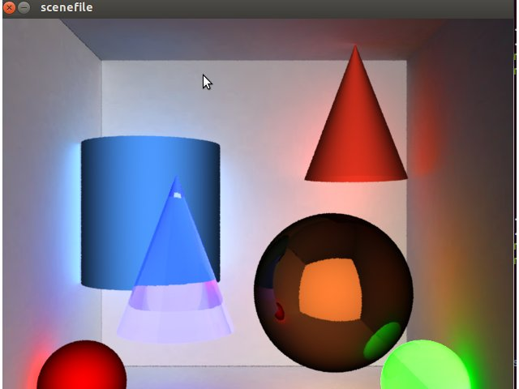
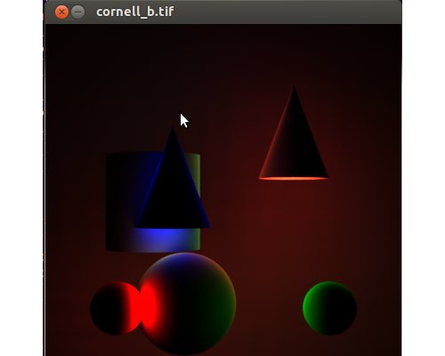
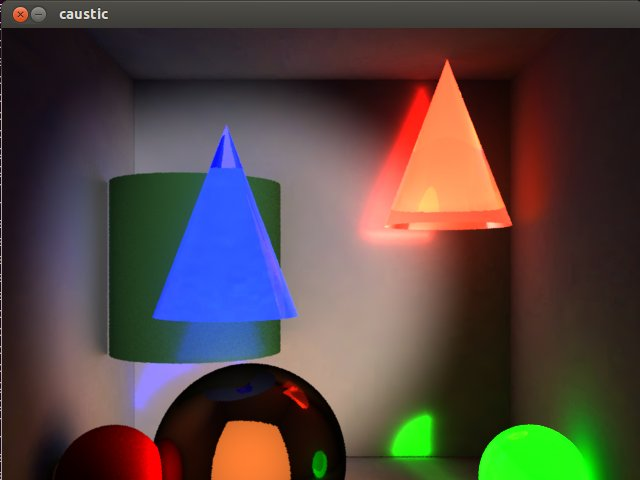
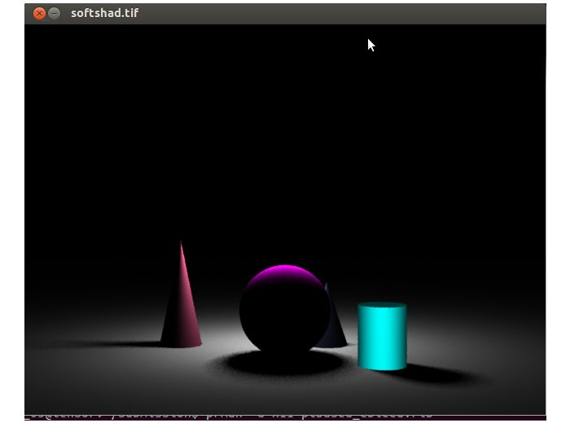

Cross-browser testing
Features
Pricing
Live API
About Us
Sign In
Sign Up
Convert HTML to Markdown
web developer and programmer tools
World's simplest HTML to Markdown transformer. Just paste your HTML in the form below, press Convert to Markdown button, and you get Markdown. Press button, get Markdown. No ads, nonsense or garbage.
# Renderman

## CS 775 Computer Graphics - Assignment 1 Part 2

* * *

[Problem Statment](http://www.cse.iitb.ac.in/~paragc/teaching/2014/cs775/assignments/A2/A2.pdf)  

*   We translated the scene, created in Part1 of Assignment, using <bscnparser.cpp< b="">function. The output is rendered using both raytraced and pointbased method of Renderman.</bscnparser.cpp<>
*   For the translated scene:
    *   For diffuse surface, we had used default matte shader.
    *   For the reflective surface, we had write our own shader, simpletrace2.sl.
    *   For the transparent surface, we had used predefined glassrefr.sl surface shader, with certain modification.
    *   Compilation:

        make

    *   Execution :

        ./prRayTracer scenefile output.rib  

        prman -d x11 output.rib

*   We have applied colorbleeding, to the translated scene using both raytraced(photon_colorbleeding.rib) and pointbased method of Renderman(ptbased_cbleed.rib and samp_ptcolorbleed.rib).
    *   Shaders used for different surfaces are not changed. Cornell box is added around the scene for proper view of the effects.
    *   For pointbased method, first ptbased_cbleed.rib will generate the point cloud for the scene, using which samp_ptcolorbleed.rib render the scene.
    *   For raytraced method we have simply used indirectsurf.sl shader.
    *   Execution : Raytrace Method

        prman -d x11 photon_colorbleeding.rib

    *   Execution : Pointbased Method

        prman -d x11 ptbased_cbleed.rib

        prman -d x11 samp_cbleed.rib

*   We have applied caustics, to the translated scene using raytrace method(caustic.rib)
    *   Shaders used for different surfaces are not changed. Cornell box is added around the scene for proper view of the effects.
    *   First a caustic map(causticrefl.cpm) is generated using generate_photon_map.rib.
    *   Scene is rendered using caustic.rib
    *   Execution : Pointbased Method

        prman -d x11 genereate_photon_map.rib

        prman -d x11 caustic.rib

*   We have added areaLight and soft shadow in file softshadow.rib
    *   Execution :

        prman -d x11 softshadow.rib

*   We have added texture to 2 objects in the scene in file texture.rib
    *   Execution :

        prman -d x11 texture.rib

### 

Colorbleeding

### 

Caustic

### 

Shadows and AreaLight

 
[Copy to clipboard] (undo)

Need to convert Markdown to HTML instead?

Use the Markdown to HTML Converter!

Looking for more programming tools? Try these!

URL Encoder

URL Decoder

URL Parser

HTML Encoder

HTML Decoder

Base64 Encoder

Base64 Decoder

HTML Prettifier

HTML Minifier

JSON Prettifier

JSON Minifier

JSON Escaper

JSON Unescaper

JSON Validator

JS Prettifier

JS Minifier

JS Validator

CSS Prettify

CSS Minifier

XML Prettifier

XML Minifier

XML to JSON Converter

JSON to XML Converter

XML to CSV Converter

CSV to XML Converter

XML to YAML Converter

YAML to XML Converter

YAML to TSV Converter

TSV to YAML Converter

XML to TSV Converter

TSV to XML Converter

XML to Text Converter

JSON to CSV Converter

CSV to JSON Converter

JSON to YAML Converter

YAML to JSON Converter

JSON to TSV Converter

TSV to JSON Converter

JSON to Text Converter

CSV to YAML Converter

YAML to CSV Converter

TSV to CSV Converter

CSV to TSV Converter

CSV to Text Columns Converter

Text Columns to CSV Converter

TSV to Text Columns Converter

Text Columns to TSV Converter

CSV Transposer

CSV Columns to Rows Converter

CSV Rows to Columns Converter

CSV Column Swapper

CSV Column Exporter

CSV Column Replacer

CSV Column Prepender

CSV Column Appender

CSV Column Inserter

CSV Column Deleter

CSV Delimiter Changer

TSV Transposer

TSV Columns to Rows Converter

TSV Rows to Columns Converter

TSV Column Swapper

TSV Column Exporter

TSV Column Replacer

TSV Column Prepender

TSV Column Appender

TSV Column Inserter

TSV Column Deleter

TSV Delimiter Changer

Delimited Column Exporter

Delimited Column Deleter

Delimited Column Replacer

Text Transposer

Text Columns to Rows Converter

Text Rows to Columns Converter

Text Column Swapper

Text Column Delimiter Changer

HTML to Markdown Converter

Markdown to HTML Converter

HTML to Jade Converter

Jade to HTML Converter

BBCode to HTML Converter

BBCode to Jade Converter

BBCode to Text Converter

HTML to Text Converter

HTML Stripper

Text to HTML Entities Converter

UNIX time to UTC time Converter

UTC time to UNIX time Converter

IP to Binary Converter

Binary to IP Converter

IP to Decimal Converter

Octal to IP Converter

IP to Octal Converter

Decimal to IP Converter

IP to Hex Converter

Hex to IP Converter

IP Address Sorter

MySQL Password Generator

MariaDB Password Generator

Postgres Password Generator

Bcrypt Password Generator

Bcrypt Password Checker

Scrypt Password Generator

Scrypt Password Checker

ROT13 Encoder/Decoder

ROT47 Encoder/Decoder

Punycode Encoder

Punycode Decoder

Base32 Encoder

Base32 Decoder

Base58 Encoder

Base58 Decoder

Ascii85 Encoder

Ascii85 Decoder

UTF8 Encoder

UTF8 Decoder

UTF16 Encoder

UTF16 Decoder

Uuencoder

Uudecoder

Morse Code Encoder

Morse Code Decoder

XOR Encryptor

XOR Decryptor

AES Encryptor

AES Decryptor

RC4 Encryptor

RC4 Decryptor

DES Encryptor

DES Decryptor

Triple DES Encryptor

Triple DES Decryptor

Rabbit Encryptor

Rabbit Decryptor

NTLM Hash Calculator

MD2 Hash Calculator

MD4 Hash Calculator

MD5 Hash Calculator

MD6 Hash Calculator

RipeMD128 Hash Calculator

RipeMD160 Hash Calculator

RipeMD256 Hash Calculator

RipeMD320 Hash Calculator

SHA1 Hash Calculator

SHA2 Hash Calculator

SHA224 Hash Calculator

SHA256 Hash Calculator

SHA384 Hash Calculator

SHA512 Hash Calculator

SHA3 Hash Calculator

CRC16 Hash Calculator

CRC32 Hash Calculator

Adler32 Hash Calculator

Whirlpool Hash Calculator

All Hashes Calculator

Seconds to H:M:S Converter

H:M:S to Seconds Converter

Seconds to Human Readable Time

Binary to Octal Converter

Binary to Decimal Converter

Binary to Hex Converter

Octal to Binary Converter

Octal to Decimal Converter

Octal to Hex Converter

Decimal to Binary Converter

Decimal to Octal Converter

Decimal to Hex Converter

Hex to Binary Converter

Hex to Octal Converter

Hex to Decimal Converter

Decimal to BCD Converter

BCD to Decimal Converter

Octal to BCD Converter

BCD to Octal Converter

Hex to BCD Converter

BCD to Hex Converter

Binary to Gray Converter

Gray to Binary Converter

Octal to Gray Converter

Gray to Octal Converter

Decimal to Gray Converter

Gray to Decimal Converter

Hexadecimal to Gray Converter

Gray to Hexadecimal Converter

Number Base Converter

Roman to Decimal Converter

Decimal to Roman Converter

Numbers to Words Converter

Words to Numbers Converter

Text to ASCII Codes Converter

ASCII to Text Converter

Text to Binary Converter

Binary to Text Converter

Text to Octal Converter

Octal to Text Converter

Text to Decimal Converter

Decimal to Text Converter

Text to Hex Converter

Hex to Text Converter

Text to Lowercase Converter

Text to Uppercase Converter

Text to Randomcase Converter

Text to Titlecase Converter

Capitalize Words in Text

Text Case Inverter

Truncate Text Lines

Trim Text Lines

Spaces to Tabs Converter

Tabs to Spaces Converter

Spaces to Newlines Converter

Newlines to Spaces Converter

Character Accent Remover

Extra Whitespaces Remover

All Whitespaces Remover

Punctuation Mark Remover

Thousands Separator Adder

Backslash Remover

Backslash Adder

Text Transformer

Text Repeater

Text Replacer

Text Reverser

Text Length Calculator

Alphabetic Text Sorter

Numeric Text Sorter

Text by Length Sorter

Text From Regex Generator

Center Text

Right-Align Text

Left-Pad Text

Right-Pad Text

Justify Text

Text Column Formatter

Regex Match Extractor

Regex Match Replacer

Email Extractor

URL Extractor

Number Extractor

List Merger

List Zipper

List Intersection

List Difference

Printf Formatter

Text Grep

Text Head

Text Tail

Line Range Extractor

Word Sorter

Word Wrapper

Word Splitter

Add Line Numbers

Add Line Prefixes

Add Line Suffixes

Append Prefix and Suffix

Find Longest Text Line

Find Shortest Text Line

Duplicate Line Remover

Empty Line Remover

Text Line Randomizer

Letter Randomizer

Text Line Joiner

String Splitter

Text Line Reverser

Text Line Filter

Number of Letters in Text Counter

Number of Words in Text Counter

Number of Lines in Text Counter

Number of Paragraphs in Text Counter

Word Frequency Calculator

Phrase Frequency Calculator

Text Statistics

Random Element Picker

Random Password Generator

Random String Generator

Random Number Generator

Random Fraction Generator

Random Bin Generator

Random Oct Generator

Random Dec Generator

Random Hex Generator

Random Byte Generator

Random IP Generator

Random MAC Generator

Random UUID Generator

Random GUID Generator

Random Date Generator

Random Time Generator

Prime Number Generator

Fibonacci Number Generator

Pi Digit Generator

E Digit Generator

Decimal to Scientific Converter

Scientific to Decimal Converter

JPG to PNG Converter

PNG to JPG Converter

GIF to PNG Converter

GIF to JPG Converter

BMP to PNG Converter

BMP to JPG Converter

Image to Base64 Converter

File to Base64 Converter

Hex to RGB Converter

RGB to Hex Converter

CMYK to RGB Converter

RGB to CMYK Converter

CMYK to Hex Converter

Hex to CMYK Converter

IDN Encoder

IDN Decoder

Miles to Kilometers Converter

Kilometers to Miles Converter

Celsius to Fahrenheit Converter

Fahrenheit to Celsius Converter

Radians to Degrees Converter

Degrees to Radians Converter

Pounds to Kilograms Converter

Kilograms to Pounds Converter

My IP Address

All Tools
Pro tip: You can use ?input=text query argument to pass text to tools.
Subscribe to updates!
Cross-browser testing
Cross-browser testing
About Us
Why Choose Us
Contact Us
Support & Help
Blog
Live API
Dev Tools
Extensions
Bookmarklets
Our Webcomic
Follow Us
© 2017 Browserling Inc. All rights reserved.
Terms of Service
Privacy Policy
Part of the exclusive HACKERS/FOUNDERS startup accelerator.

