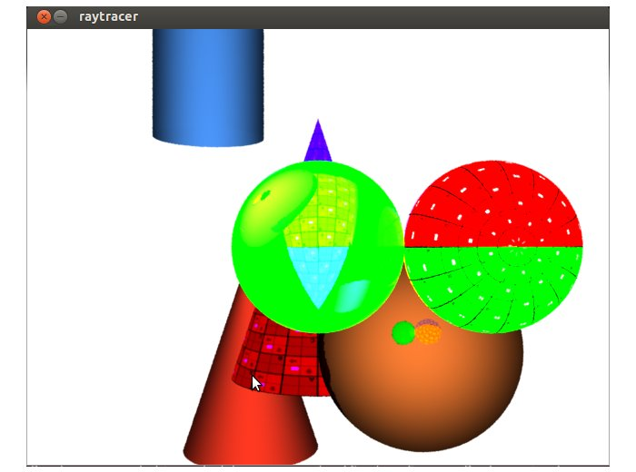
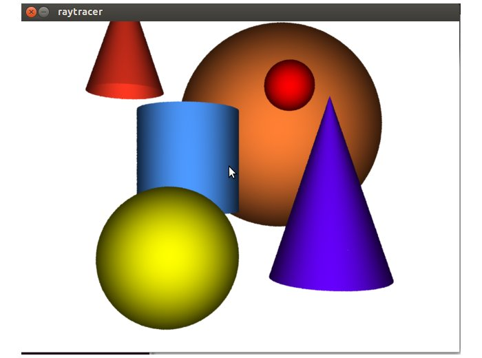
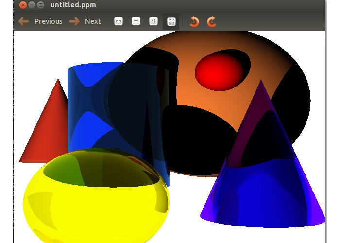
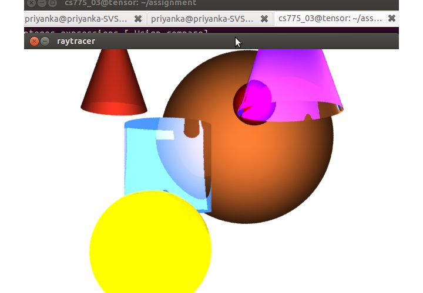
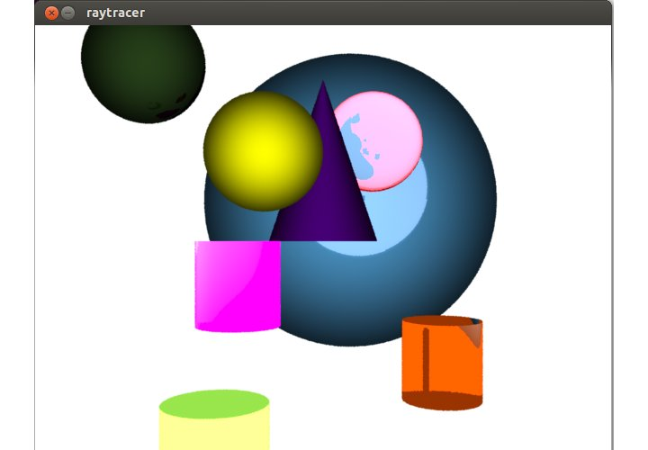
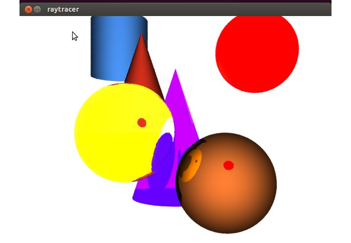

# Renderman

## CS 775 Computer Graphics - Assignment 1 Part 2

* * *

[Problem Statment](http://www.cse.iitb.ac.in/~paragc/teaching/2014/cs775/assignments/A2/A2.pdf)  

*   We translated the scene, created in Part1 of Assignment, using <bscnparser.cpp< b="">function. The output is rendered using both raytraced and pointbased method of Renderman.</bscnparser.cpp<>
*   For the translated scene:
    *   For diffuse surface, we had used default matte shader.
    *   For the reflective surface, we had write our own shader, simpletrace2.sl.
    *   For the transparent surface, we had used predefined glassrefr.sl surface shader, with certain modification.
    *   Compilation:

        make

    *   Execution :

        ./prRayTracer scenefile output.rib  

        prman -d x11 output.rib

*   We have applied colorbleeding, to the translated scene using both raytraced(photon_colorbleeding.rib) and pointbased method of Renderman(ptbased_cbleed.rib and samp_ptcolorbleed.rib).
    *   Shaders used for different surfaces are not changed. Cornell box is added around the scene for proper view of the effects.
    *   For pointbased method, first ptbased_cbleed.rib will generate the point cloud for the scene, using which samp_ptcolorbleed.rib render the scene.
    *   For raytraced method we have simply used indirectsurf.sl shader.
    *   Execution : Raytrace Method

        prman -d x11 photon_colorbleeding.rib

    *   Execution : Pointbased Method

        prman -d x11 ptbased_cbleed.rib

        prman -d x11 samp_cbleed.rib

*   We have applied caustics, to the translated scene using raytrace method(caustic.rib)
    *   Shaders used for different surfaces are not changed. Cornell box is added around the scene for proper view of the effects.
    *   First a caustic map(causticrefl.cpm) is generated using generate_photon_map.rib.
    *   Scene is rendered using caustic.rib
    *   Execution : Pointbased Method

        prman -d x11 genereate_photon_map.rib

        prman -d x11 caustic.rib

*   We have added areaLight and soft shadow in file softshadow.rib
    *   Execution :

        prman -d x11 softshadow.rib

*   We have added texture to 2 objects in the scene in file texture.rib
    *   Execution :

        prman -d x11 texture.rib

### 

Colorbleeding

### 

Caustic

### 

Shadows and AreaLight

### 

Texture

### 

Comparision of our Output with PRman Output

<table>

<tbody>

<tr>

<td></td>

<td></td>

</tr>

</tbody>

</table>

<table>

<tbody>

<tr>

<td></td>

<td></td>

</tr>

</tbody>

</table>

<table>

<tbody>

<tr>

<td></td>

<td></td>

</tr>

</tbody>

</table>

<table>

<tbody>

<tr>

<td></td>

<td></td>

</tr>

</tbody>

</table>

### Acknowledgement
