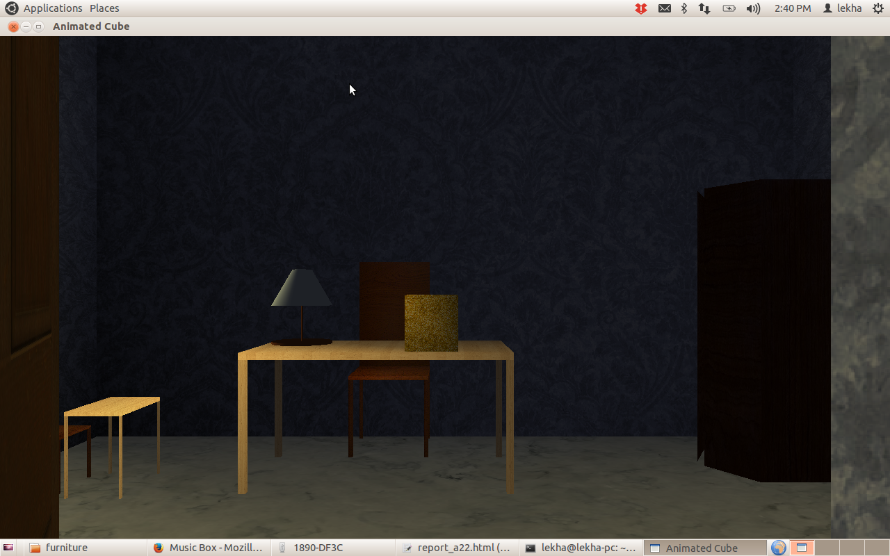
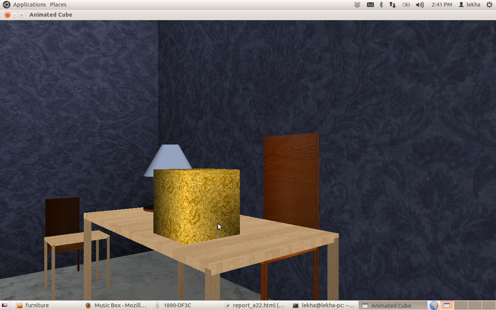
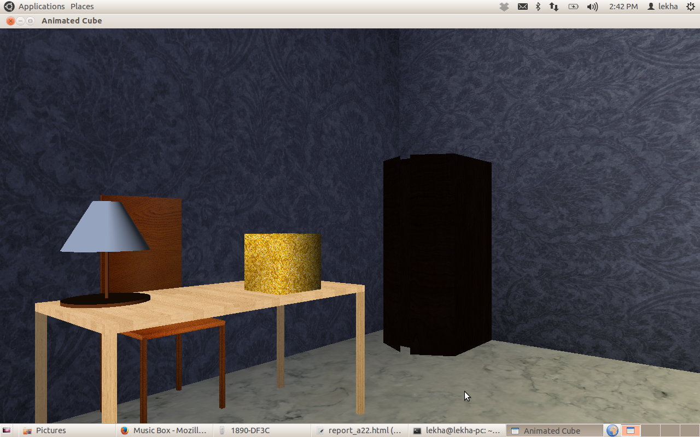
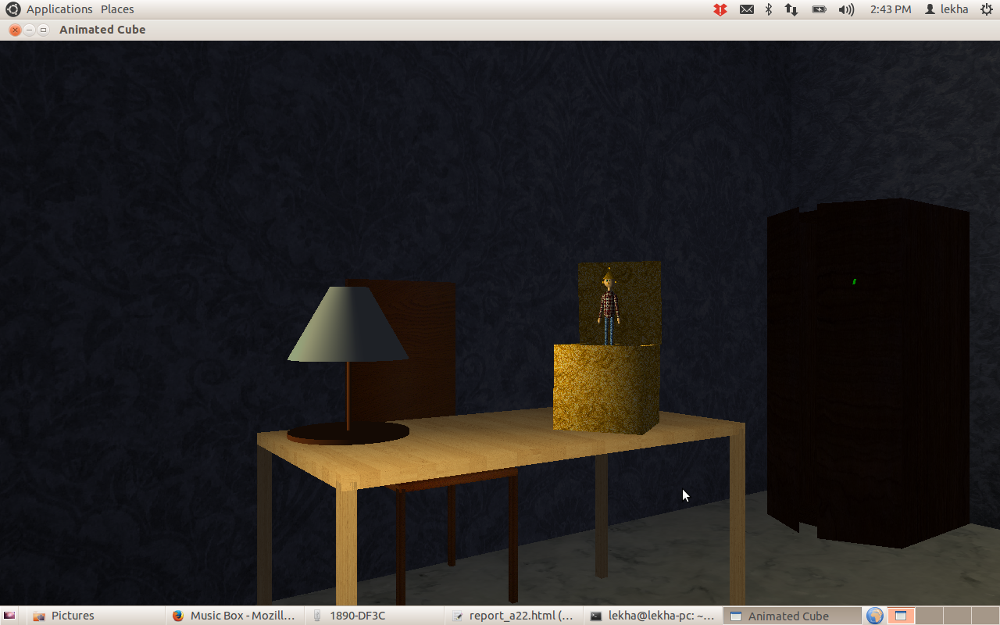
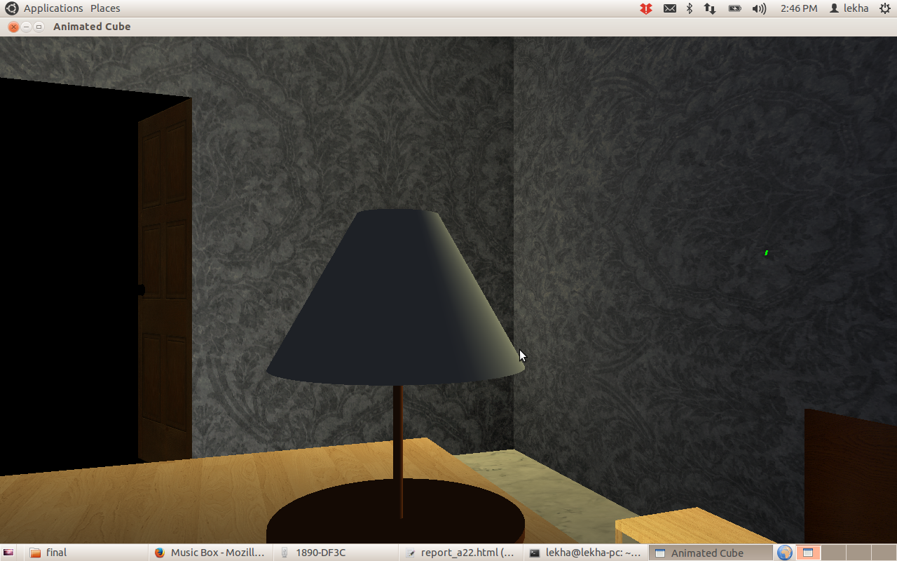

# Music Box

## CS 675 Computer Graphics - Assignment 2 Part 2

* * *
### [Problem Statement](A22.pdf)
### Keyboard Shortcuts:

#### While drawing camera flythrough:

*   Up arrow/Down arrow ---Select current Z axis coordinate
*   f ---Start Camera Animation

#### Lights:

*   W ---Toggle Wall light
*   L ---Toggle table lamp

#### Box and human and scene movements:

*   I ---Initial Position for all parts
*   s ---Scene
*   t ---Torso
*   n ---Neck
*   h ---Head
*   q ---Left Upper Arm
*   w ---Left Lower Arm
*   e ---Left Hand
*   p ---Right Upper Arm
*   o ---Right Lower Arm
*   i ---Right Hand
*   z ---Left Upper Leg
*   c ---Left Lower Leg
*   a ---Left Foot
*   m ---Right Upper Leg
*   b ---Right Lower Leg
*   l ---Right Foot

*Legs and arms shortcut are related to keyboard layout of alphabets.

* * *

### Rotation Controls:

*   0 ---Initial position for selected part
*   1,2 ---X axis
*   3,4 ---Y axis
*   5,6 ---Z axis

* * *

### Acknowledgements:

1.  Sample codes for lookat

* * *

    

<address></address>

Last modified: Fri Oct 11 19:43:23 IST 2013
